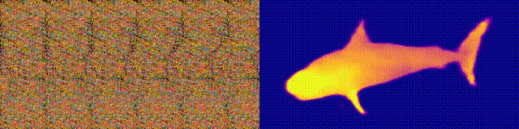
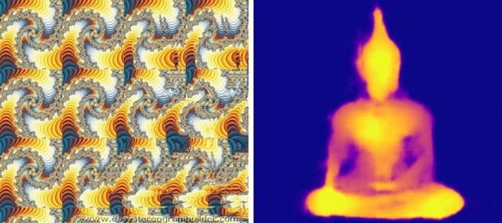
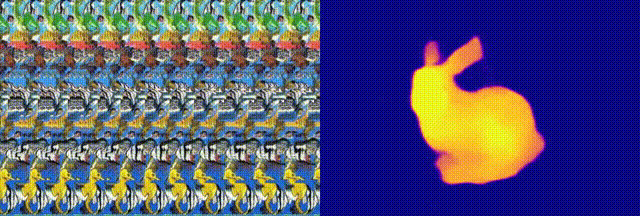
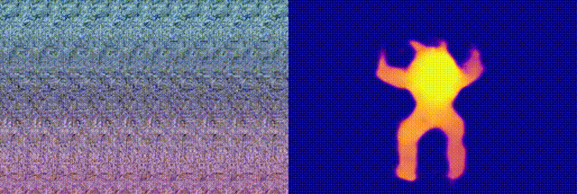
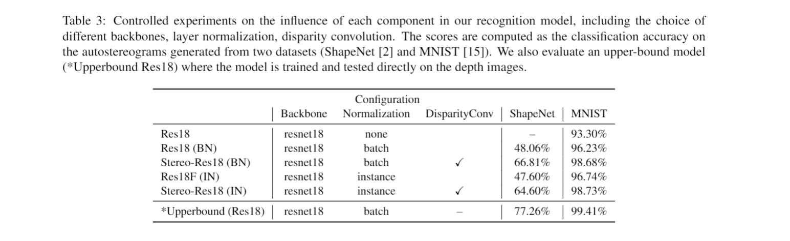

# Neural Magic Eye 

[Preprint](<https://arxiv.org/abs/20xx.xxxxxx>) | [Project Page](<https://jiupinjia.github.io/neuralmagiceye/>)  | [Colab Runtime](<https://colab.research.google.com/drive/xxxxxxxxxxxxxxxxxx?usp=sharing/>)

### Official PyTorch implementation of the preprint paper "NeuralMagicEye: Learning to See and Understand the Scene Behind anAutostereogram", arXiv:20xx.xxxxx.

An autostereogram, a.k.a. magic eye image, is a single-image stereogram that can create visual illusions of 3D scenes from 2D textures. This paper studies an interesting question that whether a deep CNN can be trained to recover the depth behind an autostereogram and understand its content. The key to the autostereogram magic lies in the stereopsis - to solve such a problem, a model has to learn to discover and estimate disparity from the quasi-periodic textures. We show that deep CNNs embedded with disparity convolution, a novel convolutional layer proposed in this paper that simulates stereopsis and encodes disparity, can nicely solve such a problem after being sufficiently trained on a large 3D object dataset in a self-supervised fashion. We refer to our method as  "NeuralMagicEye". Experiments show that our method can accurately recover the depth behind autostereograms with rich details and gradient smoothness. Experiments also show the completely different working mechanisms for autostereogram perception between neural networks and human eyes. We hope this research can help people with visual impairments and those who have trouble viewing autostereograms.




In this repository, we provide the complete training/inference implementation of our paper based on Pytorch and provide several demos that can be used for reproducing the results reported in our paper. With the code, you can also try on your own data by following the instructions below.

The implementation of the UNet architecture in our code is partially adapted from the project [pytorch-CycleGAN-and-pix2pix](https://github.com/junyanz/pytorch-CycleGAN-and-pix2pix).


## License

See the [LICENSE](LICENSE.md) file for license rights and limitations (MIT).


## One-min video result

[](https://www.youtube.com/watch?v=Fkh7DEblqJ8)


## Requirements

See [Requirements.txt](Requirements.txt).


## Setup

1. Clone this repo:

```bash
git clone https://github.com/jiupinjia/neural-magic-eye.git 
cd neural-magic-eye
```

2. Download our pretrained autostereogram decoding network from the [Google Drive](https://drive.google.com/file/d/1er9j1kX7bXljlj9vMwDr7Hb9zfL2XAns/view?usp=sharing), and unzip them to the repo directory.

```bash
unzip checkpoints_decode_sp_u256_bn_df.zip
```


## To reproduce our results

#### Decoding autostereograms



```bash
python demo_decode_image.py --in_folder ./test_images --out_folder ./decode_output --net_G unet_256 --norm_type batch --with_disparity_conv --in_size 256 --checkpoint_dir ./checkpoints_decode_sp_u256_bn_df
```

#### Decoding autostereograms (animated)

- Stanford Bunny



```bash
python demo_decode_animated.py --in_file ./test_videos/bunny.mp4 --out_folder ./decode_output --net_G unet_256 --norm_type batch --with_disparity_conv --in_size 256 --checkpoint_dir ./checkpoints_decode_sp_u256_bn_df
```

- Stanford Armadillo



```bash
python demo_decode_animated.py --in_file ./test_videos/bunny.mp4 --out_folder ./decode_output --net_G unet_256 --norm_type batch --with_disparity_conv --in_size 256 --checkpoint_dir ./checkpoints_decode_sp_u256_bn_df
```


## Google Colab

Here we also provide a minimal working example of the inference runtime of our method. Check out [this link](https://colab.research.google.com/drive/xxxxxxxxxxxxxxxxxx?usp=sharing/) and see your result on Colab.


## To retrain your decoding/classification model

If you want to retrain our model, or want to try a different network configuration, you will first need to download our [experimental dataset](https://drive.google.com/file/d/1skp2cLiVxAVYdqQGJuqx-txIHf4hyJTq/view?usp=sharing) and then unzip it to the repo directory. 

```bash
unzip datasets.zip
```

Note that to build the training pipeline, you will need a set of depth images and background textures, which are already there included in our pre-processed dataset (see folders `./dataset/ShapeNetCore.v2` and `./dataset/Textures` for more details). The autostereograms will be generated on the fly during the training process.

In the following, we provide several examples for training our decoding/classification models with different configurations. Particularly, if you can check out  `--net_G` ,  `--norm_type` , `--with_disparity_conv` and  `--with_skip_connection`  for more details if you are interested in exploring different network architectures.

#### To train the decoding network (on mnist dataset, unet_64 + bn, without disparity_conv)

```bash
python train_decoder.py --dataset mnist --net_G unet_64 --in_size 64 --batch_size 32 --norm_type batch --checkpoint_dir ./checkpoints_your_model_name_here --vis_dir ./val_out_your_model_name_here
```

#### To train the decoding network (on shapenet dataset, resnet18 + in + disparity_conv + fpn)

```bash
python train_decoder.py --dataset shapenet --net_G resnet18fcn --in_size 128 --batch_size 32 --norm_type instance --with_disparity_conv --with_skip_connection --checkpoint_dir ./checkpoints_your_model_name_here --vis_dir ./val_out_your_model_name_here
```

#### To train the watermark decoding model (unet256 + bn + disparity_conv)

```bash
python train_decoder.py --dataset watermarking --net_G unet_256 --in_size 256 --batch_size 16 --norm_type batch --with_disparity_conv --checkpoint_dir ./checkpoints_your_model_name_here --vis_dir ./val_out_your_model_name_here
```

#### To train the classification network (on mnist dataset, resnet18 + in + disparity_conv)

```bash
python train_classifier.py --dataset mnist --net_G resnet18 --in_size 64 --batch_size 32 --norm_type instance --with_disparity_conv --checkpoint_dir ./checkpoints_your_model_name_here --vis_dir ./val_out_your_model_name_here
```

#### To train the classification network (on shapenet dataset, resnet18 + bn + disparity_conv)

```bash
python train_classifier.py --dataset shapenet --net_G resnet18 --in_size 64 --batch_size 32 --norm_type batch --with_disparity_conv --checkpoint_dir ./checkpoints_your_model_name_here --vis_dir ./val_out_your_model_name_here
```

#### Network architectures and performance

In the following, we show the decoding/classification accuracy with different model architectures. We hope these statistics can give you some help in model configurations.





## Citation

If you use our code for your research, please cite the following paper:

``````
@inproceedings{zou2020xxxxx,
    title={NeuralMagicEye: Learning to See and Understand the Scene Behind an Autostereogram},
      author={Zhengxia Zou and Tianyang Shi and Yi Yuan and Zhenwei Shi},
      year={2020},
      eprint={20xx.xxxx},
      archivePrefix={arXiv},
      primaryClass={cs.CV}
}
``````

